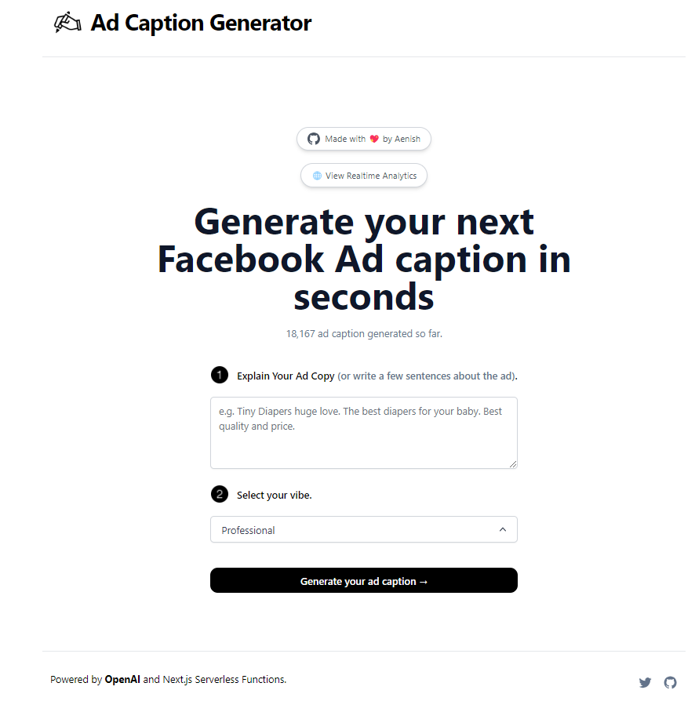

# [vps.aenishshrestha.com](https://www.vps.aenishshrestha.com/)

This project generates Facebook Ad Caption for you using AI.

[](https://www.vps.aenishshrestha.com)

## How it works

This project uses the [Nvidia API](https://build.nvidia.com/mistralai/mixtral-8x22b-instruct?signin=true&api-key=true) (specifically, mistralai / mixtral-8x22b-instruct-v0.1) and Vercel Serverless functions. It constructs a prompt based on the form and user input, sends it to the Mistralai API via a Vercel Serverless function, then responds the response back to the application.

## Running Locally

After cloning the repo, go to [Nvidia API](https://build.nvidia.com/mistralai/mixtral-8x22b-instruct?signin=true&api-key=true), to make an account and put your API key in a file called `.env`.

Then, run the application in the command line and it will be available at `http://localhost:3000`.

```bash
npm run dev
```

## One-Click Deploy

Deploy the example using [Vercel](https://vercel.com?utm_source=github&utm_medium=readme&utm_campaign=vercel-examples):

[](https://vercel.com/new/clone?repository-url=https://github.com/AenishShrestha/twitterbio_serverless&env=OPENAI_API_KEY&project-name=facebook-ad-caption-generator&repo-name=facebookadcaption)

Note: This project is forked from [Nutlope](https://github.com/Nutlope/twitterbio.git). He is the best. 
